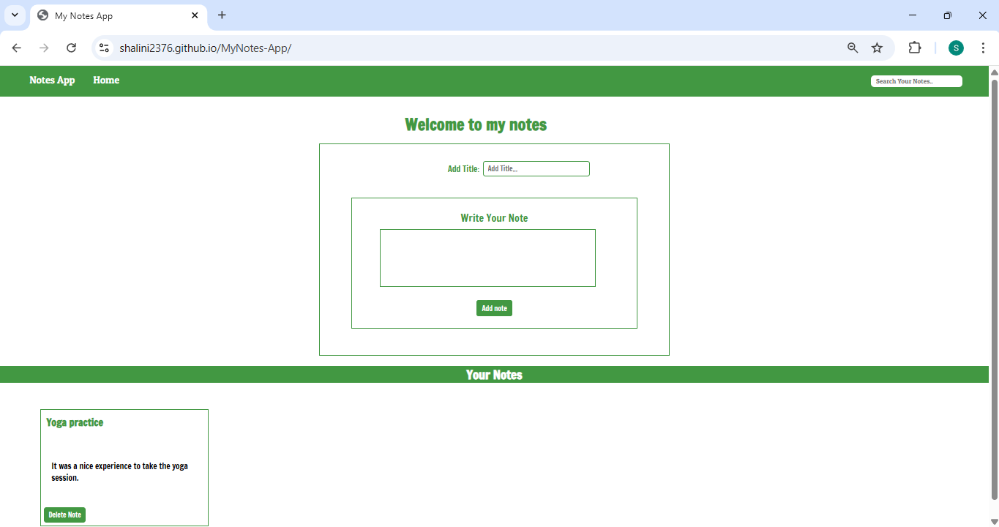

# MyNotes App

A simple **Notes application** built using **HTML, CSS, and JavaScript**.  
It allows users to add, search, and delete notes, providing a lightweight way to manage short notes directly in the browser.

## ✨ Features
- Add new notes easily
- Search notes by text
- Delete individual notes
- Dynamic UI updates using JavaScript
- Simple and clean user interface

## 📸 Screenshot
  

## 🛠 Tech Stack
- HTML5
- CSS3
- JavaScript (Vanilla)

## ▶️ How to Run Locally
1. Clone the repository:
   ```bash
   git clone https://github.com/shalini2376/MyNotes-App.git
   ```
2. Open the project folder.
3. Open index.html in your browser.
